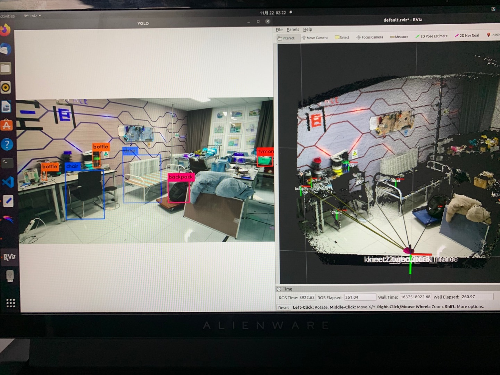
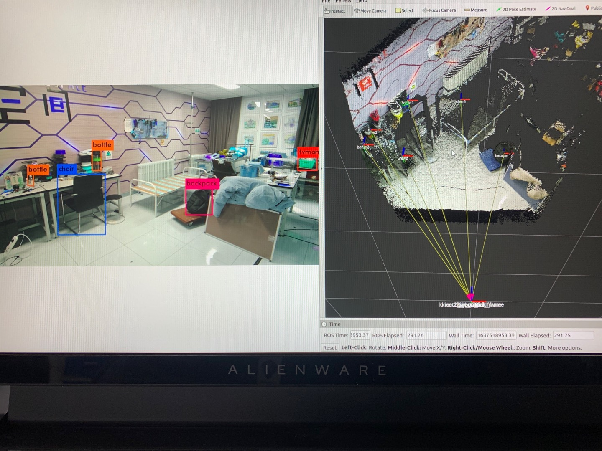

# description
This is a package that combines darknet_ros and iai_kinect2 in order to get the 3D location of the objects detected.
It will automatically send the tf transforms between the objects and kinect2_link.




# system requirements
* I only tested on Ubuntu 20.04
* Remember to downgrade the gcc and g++ version of your system to 7 (my Ubuntu 20.04 is default 8)

# dependencies
* [libfreenect2](https://github.com/OpenKinect/libfreenect2.git)
* python3-pcl
```sh
pip install python3-pcl
```

* ros_numpy
```sh
sudo apt-get install ros-noetic-ros-numpy
```

* [darknet_ros](https://github.com/0nhc/darknet_ros)
* [iai_kinect2](https://github.com/0nhc/iai_kinect2)
